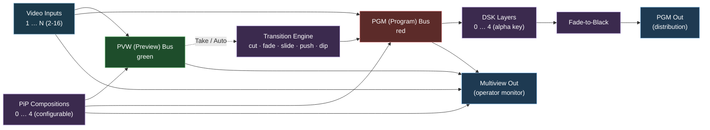

# Vision Mixer — Operator Guide

> **Code is the source of truth.** This guide describes intended behaviour and may have
> drifted from the current implementation. When in doubt, read the code and check the in-app UI.

A reference to the production switcher block in strom: the PVW/PGM
workflow, transitions, Picture-in-Picture, downstream keying, and the
multiview monitor. Written for vision/video engineers — no software
internals, just operator-facing behavior.

The mixer behaves like a small broadcast switcher with a green
preview bus and a red program bus. If you've operated an ATEM, Tricaster
or vMix, the layout will feel familiar.

---

## 1. At a glance



| Input / output | Count | Notes |
|---|---|---|
| Video inputs | 2 – 16 (default 4) | Set at construction time. Each input is also exposed on the multiview thumbnail grid. |
| DSK inputs | 0 – 4 (default 0) | Separate input pads. Alpha-keyed graphics overlaid on PGM. |
| Audio inputs | One per video input + a dedicated PGM Audio input | Used only for VU-meter rendering on the multiview overlay. They do not pass through the video mixer's outputs. |
| PiP compositions | 0 – 4 (default 0) | Virtual sources built from a background + overlay zones. |
| PGM output | 1 video pad | The on-air distribution feed (1920×1080 @ 30 fps by default). |
| Multiview output | 1 video pad | Operator monitor with PVW/PGM big displays, thumbnails, clock, labels and VU meters. (1280×720 @ 30 fps by default.) |

---

## 2. The PVW / PGM workflow

This is the core operating model. Two buses are always live:

- **PGM (Program)** — the on-air feed. What you send to PGM is what
  goes out of the `PGM Out` pad to viewers/recorders/streams.
- **PVW (Preview)** — what comes next. PVW is fully composed and
  rendered to the multiview, but never reaches the PGM output until you
  explicitly **take** it.

```
   Sources                                                Out
   ───────                                                ───
   Input 1 ──┐                              ┌──► PGM ──► PGM Out
   Input 2 ──┼──► [PVW]    Take/Auto        │
   Input 3 ──┤   (preview)  ─────────────►  ┤
    …        │                              │
   PiP 1 ────┤                              │
   PiP 2 ────┘   [PGM]  ◄──── swaps ──────► [PVW]
                (live)
```

**Take rules**

- Pressing **Take** swaps PVW ↔ PGM **atomically**. The previous PGM
  source automatically becomes the new PVW — never any dead air or
  in-between state.
- A take can be a **Cut** (instant) or an **Auto** (animated transition,
  see §3). The transition you get is whichever type and duration are
  currently selected.
- You can **change PVW at any time**, including while a take is in flight.
  Selecting a new PVW source updates the preview immediately. The next
  Take will use whatever PVW is at the moment the button is pressed.

**Source types on each bus**

| Source kind | How it shows on the bus |
|---|---|
| A regular video **Input** | The input fills the bus output. |
| A **PiP** composition | The PiP's background fills the bus output and its overlay zones tile on top — exactly as configured in §4. |

A PiP can be put on PVW *or* on PGM, just like any other source.

---

## 3. Transitions

### 3.1 Transition types

| Type | What it does | Duration honored? |
|---|---|---|
| `cut` | Instant swap, no animation. | No (always 0). |
| `fade` *(default)* | Cross-fade (alpha blend) between PVW and PGM. | Yes. |
| `slide_left/right/up/down` | New picture slides in **over** the old one, which stays in place until covered. The direction names the motion. | Yes. |
| `push_left/right/up/down` | Old and new picture move **together** — the new one pushes the old out of frame. | Yes. |
| `dip_to_black` | Fade out to black over the first half, fade the new picture in over the second. | Yes. |

**Shader transitions** (GPU backend with Shader FX enabled — see §3.4).
On the operator page the production staples (directional wipes, iris,
barn doors, luma) are shown directly; the novelty shapes and most master
FX sit behind a **MORE** toggle. The API accepts all types regardless:

| Type | What it does |
|---|---|
| `wipe_left/right/up/down` | Soft-edged directional wipe; the new picture is revealed by a sweeping edge. |
| `clock_wipe` | Radial sweep from 12 o'clock, clockwise. |
| `iris_open` / `iris_close` | Circle grows from the center / reveal runs outside-in. |
| `blinds` | Venetian-blind slats. |
| `checker_wipe` | Checkerboard cells flip in pseudo-random order. |
| `noise_dissolve` | Granular film-style dissolve. |
| `luma_wipe` | The outgoing picture hands over darkest-areas-first. |
| `melt` | Doom-style melt — the picture drips away in columns. |
| `barn_doors` | Opens from a center seam outward. |
| `heart_iris` / `star_wipe` | A heart / five-point star grows from the center. |
| `pinwheel` | Radial blades sweep around the center. |
| `crosshatch` | Ink-sketch hatch dissolve. |
| `hex_dissolve` | Chunky hexagon cells change over in random order. |
| `warp_wipe` | Directional wipe with a smeared edge. |
| `glitch_cut` | Digital glitch burst (RGB split, tearing) hiding a hard cut at its peak. |
| `flash_dissolve` | White flash riding on a crossfade. |
| `whip_pan_left/right` | Push with heavy directional motion blur — reads as a camera whip. |
| `punch_zoom` | Zoom kick with camera shake around the cut. |
| `pixelate_take` | The frame dissolves into coarse blocks across the cut and resolves back. |
| `zoom_blur` | Radial streak blur through the cut. |
| `spin` | The frame twists through the cut. |
| `tv_roll` | TV sync-loss vertical roll through the cut. |
| `negative_flash` | The frame inverts through a crossfade. |
| `ripple` | A water ring distorts the whole program through a crossfade. |

**Duration**: 0 – 60 000 ms. **Default 300 ms.**

**Mixed aspect ratios.** Sources keep their own aspect (a 2.39:1 source
letterboxes on a 16:9 program), so the incoming picture's rectangle may
not cover the outgoing one. Slides handle this gracefully: when parts of
the old picture would stay visible next to the incoming rectangle, those
remnants fade out during the slide instead of popping away at the end.
Pushes always carry the old picture fully out of frame.

### 3.2 Engine downgrade

For some source combinations the engine will quietly substitute a
different transition. When that happens the response reports both the
requested type (`transition_type`) and what actually ran
(`actual_transition_type`).

Concretely: **any animated transition other than `fade` involving a PiP**
on either bus (input ↔ PiP, or PiP ↔ PiP) downgrades to `fade`. Slide and
push geometry is not defined for heterogeneous-source pairs. Master-FX
takes (`glitch_cut`, `flash_dissolve`, ...) keep their full-frame effect
on top of the fade. All shader transitions downgrade to `fade` when the
FX engine is unavailable (CPU backend, or Shader FX disabled).

### 3.3 Cut vs Take/Auto

| Operator button | What it triggers |
|---|---|
| **Cut** | Take with `cut` (0 ms). Instant. |
| **Take / Auto** | Take with the currently selected transition type at the currently selected duration. |

### 3.4 Shader FX engine (GPU only)

With the GPU backend and the **Shader FX** block property enabled
(default on), the mixer carries a custom-GLSL effects engine:

- **Shader transitions** — the wipe and master-FX takes in §3.1. Pick
  them with the WIPE / FX buttons on the operator page.
- **Looks** — persistent per-source effects applied wherever the source
  appears (PGM, PVW, thumbnails, PiPs): color correct, chroma key,
  pixelate, blur, duotone, vignette, VHS, old film, edge glow, CRT,
  halftone, thermal, night vision, posterize, underwater. A look can also
  sit on the **PGM master** output. Open with the LOOKS button.
  - **Color Correct** is the camera-matching tool: brightness, contrast,
    gamma, saturation, hue, plus white balance (temperature and tint).
    Every control is neutral at its default, so a freshly added Color
    Correct does nothing until you move a slider — reach for it to match
    a mismatched camera or set a white point, on a single source or on
    the PGM master.

Looks are runtime state (like DSK toggles): they reset when the flow
restarts. Looks and master-FX takes run on independent slots, so a take
plays on top of the master look and the look stays on afterwards.

On the CPU backend the FX controls are hidden and effect requests are
rejected.

### 3.5 Fade-to-Black (FTB)

FTB is independent of the take engine.

- Press **FTB** once → PGM fades to black over the requested duration
  (0 = instant). PVW is **not** affected and continues to update.
- Press **FTB** again → PGM fades back from black to whatever is
  currently on PGM.
- **A take while FTB is active automatically cancels the FTB.** You
  do not need to manually release it before going back to picture.

While FTB is engaged, the multiview shows a centered **FTB** badge over
the PGM big display so the state is impossible to miss.

---

## 4. Picture-in-Picture (PiP)

A **PiP** in this mixer is not just a single tile on PGM — it is a
**reusable multi-source composition** that can be selected to PVW or PGM
just like a regular input.

### 4.1 Anatomy of a PiP

```
  ┌─────────────────────────────────────────────────────────┐
  │  PiP region                                             │
  │  ┌──────────────────────────────────────────────────┐   │
  │  │                                                  │   │
  │  │              BACKGROUND (optional)               │   │
  │  │              one input fills the region          │   │
  │  │                                                  │   │
  │  │   ┌──────────┐    ┌──────────┐                   │   │
  │  │   │  Zone A  │    │  Zone B  │   overlay zones   │   │
  │  │   │ cap = 1  │    │ cap = 3  │   on top of bg    │   │
  │  │   │ src: [2] │    │ src:1,4,5│                   │   │
  │  │   └──────────┘    └──────────┘                   │   │
  │  └──────────────────────────────────────────────────┘   │
  └─────────────────────────────────────────────────────────┘
```

| Element | Meaning |
|---|---|
| **Background** | One input that fills the whole PiP region. Optional — a PiP can be overlay-only. |
| **Zone** | A rectangular sub-region inside the PiP that hosts one or more overlay sources. Each zone has its own position, size and capacity. |
| **Zone capacity** | Max number of overlay sources allowed in the zone. When full, pushing a new source **evicts the oldest** (FIFO). Capacity `1` is "swap mode" — replacing the source cross-fades. |
| **Auto-tile** | When a zone holds multiple sources, they auto-tile in a grid (1, 2 side-by-side, 2+1, 2×2, 3×2, etc.). Each source is fitted with its **own** aspect ratio — a 2.39:1 source letterboxes inside its cell instead of being stretched. |
| **Source crop ("punch-in")** | Each source in a PiP can carry a crop window: the visible part of the source that scales to fill its box. Think virtual PTZ — zoom into a person's face from a wide shot. See §4.4. |
| **Zone border** | A colored frame around each source box in the zone — on the **PGM output** and mirrored on the multiview (PiP tiles and the PVW display, proportionally scaled). The border belongs to the box (it survives source swaps in the zone) and is composited as part of the mix, so it tracks morphs, takes and punch-ins frame-accurately and **fades with its box** (FTB, capacity-1 cross-fades). The frame sits fully *outside* the picture edge (it never covers content), and where zones overlap the upper zone covers the lower zone's frame — like stacked framed cards. Sits below the DSK stack. Set per zone: color (`#RRGGBB` or `#RRGGBBAA`) + width in PGM pixels — the width normalizes to each render target, so 4 px on air looks like 4 px-equivalent everywhere (0 = off). |

### 4.2 Limits

| | Value |
|---|---|
| Max PiPs in the mixer | 4 |
| Max overlays per PiP (across all zones) | 15 (= max inputs − 1) |
| Sources are deduplicated across zones | The same input cannot occupy two zones in the same PiP — first zone wins. |

### 4.3 How the operator configures a PiP

> Driving the same compositions from a control surface or script instead of the page?
> See the [Producer Switching over the API guide](PRODUCER_SWITCHING_API_GUIDE.md) for
> the call-by-call recipes, what an on-air layout edit looks like, and the failure modes.

A PiP is configured at runtime from the **operator control page** served
by the backend. Press **Edit** on a PiP row to open the layout editor —
two side-by-side panels:

**Zones panel** (left)

- Pick the PiP's **background** input from the dropdown in the header.
- Add **zones** with the "+ Zone" button. Drag a zone to move it,
  drag its corners to resize it. Right-click toggles between auto-tile
  and a manual rectangle.
- **Snap** locks drags and typed values to quarters and rule-of-thirds
  anchors; **Grid** draws the guide lines (thirds in gold). Both
  toggles are shared with the crop panel.
- The control row under the canvas shows the active zone's exact
  **X/Y/W/H in PGM pixels**, its **capacity** (blank = `∞`), and its
  **border** (color swatch + width in PGM pixels; width 0 = no border).
- The numbered **source chips** are checkboxes for the **active zone**:
  filled = in this zone (click removes), dashed outline = sitting in
  another zone of the same PiP (click **moves** it here), empty = free
  (click pushes it in). The zone auto-tiles and starts evicting once it
  hits capacity.
- Selecting a zone (zone buttons, clicking a zone in the canvas) also
  points the Crop/Zoom panel at that zone's first source.
- **Layout presets** (bottom row): save the PiP's current composition —
  zones, sources, background and all crop settings — under a name, and
  load or delete saved presets. Presets are stored in the browser
  (localStorage) and shared across all PiPs, mixers and flows in it.
  Loading is best-effort: sources whose input number doesn't exist on
  the target mixer are silently skipped.

**Crop / Zoom panel** (right) — see §4.4.

A PiP starts **empty** when the mixer block is first built — there are
no static "PiP defaults" baked into the flow. Settings the operator
makes on the page apply live and are reflected in the multiview tile
for that PiP.

### 4.4 Crop & zoom (punch-in)

Every source inside a PiP can carry a **crop window** — the part of the
source picture that is visible. The window scales to fill the source's
box (its zone, or its auto-tile cell), and everything outside the window
is hidden. This is how you build the classic interview layout: three
portrait boxes side by side, each one punched in on a person's face
from a wide landscape camera.

```
   Source (wide shot)                       Zone box (portrait)
  ┌───────────────────────────┐
  │            ┌─────┐        │             ┌─────┐
  │            │ ╭─╮ │ ◄──────┼── crop      │ ╭─╮ │
  │   desk     │ │☺│ │        │   window    │ │☺│ │  ← fills the box
  │            │ ╰─╯ │        │             │ ╰─╯ │
  │            └─────┘        │             │     │
  └───────────────────────────┘             └─────┘
```

**Operating the crop editor**

| Control | What it does |
|---|---|
| **Source selector** | Pick which of the PiP's sources to crop. Shows each source's real resolution; `✂` marks sources that already carry a crop. Defaults to the active zone's source when the zone holds exactly one. |
| **Crop frame** | The frame on the source canvas *is* the visible window. **Drag to pan**, drag the **corners to zoom**. Snap/grid (shared with the zones panel) lock to quarters and thirds of the source frame — putting a face on a third reads well. |
| **Zoom slider** | 1× = the largest window that matches the box; higher values punch in further (up to 20× via the frame). |
| **X/Y/W/H** | The crop window in **source pixels** (each source uses its own resolution). |
| **Lock box aspect** *(default on)* | Keeps the crop window at the destination box's aspect so the crop fills the box exactly, edge to edge. Unlock it to frame freely — the result letterboxes inside the box instead. |
| **Reset** | Removes the crop for the selected source. **This is the only way a crop goes away** — see retention below. |

**Behavior to rely on**

- **Live and animated.** Crop changes morph smoothly (same easing as
  zone moves), and crops ride along in takes: punching a cropped PiP
  source to a full-frame input (or back) animates the punch-in/out.
  Works on both the GPU and CPU compositor backends.
- **Crops are remembered.** A source that leaves the PiP keeps its
  crop settings and gets them back when it returns — so a capacity-1
  swap zone can ping-pong between two punched-in cameras and each one
  comes back framed the way you left it. If it returns to a
  differently-shaped box, the aspect lock re-fits the window
  automatically. Use **Reset** to actually clear a crop.
- **Per PiP, per source.** The same input can be framed differently in
  different PiPs. A crop never affects the source's own multiview
  thumbnail or its appearance as a plain fullscreen source.
- **A zone with a single cropped source fills its rectangle exactly** —
  this is what makes portrait/cinema boxes possible. Multi-source zones
  keep their auto-tile cells.

### 4.5 PiPs on the multiview

Each configured PiP occupies one tile in the multiview thumbnail grid,
next to the input thumbnails. The tile shows the live PiP composition
(background + zones) so the operator can see what they'd be cutting to
*before* sending it to PVW or PGM.

---

## 5. Downstream Keyer (DSK)

A DSK channel overlays a graphics input (lower thirds, station logo, a
CEF-rendered web overlay) **on top of the PGM output**.

```
   …→ PGM mix ──► [DSK 1] ──► [DSK 2] ──► [DSK 3] ──► [DSK 4] ──► FTB ──► PGM Out
                  (alpha)     (alpha)     (alpha)     (alpha)
```

| Aspect | Behavior |
|---|---|
| **Channels** | 0 – 4 (default 0). Configured at construction time. |
| **Keying** | Alpha-channel only. The DSK input must carry its own alpha — there is no separate fill+key pair. Pre-rendered graphics, CEF browser sources, animated video with embedded alpha all work. |
| **Toggle** | Each DSK is a binary **on/off**. There is **no fade-in/out** — DSK is an instant toggle. (Use a CEF overlay with its own animation if you need to ease graphics in.) |
| **Stacking** | DSK1 sits closest to the program; DSK4 sits on top. The DSK stack always renders **above** the PGM composition (including PiP overlays). |
| **Multiview** | DSK overlays do **not** appear in the multiview output. The multiview shows the clean PGM mix without DSK. |
| **Audio** | DSK pads are **video only**. If your graphics source has audio, route it separately. |

---

## 6. The multiview monitor

The multiview is the operator's monitor. Default resolution 1280×720 @
30 fps.

```
  ┌──────────────────────────────────────────────────────────────┐
  │                          14:35:42 CEST                       │  ← clock (top center)
  │                                                              │
  │   ┌─────────────────────────┐   ┌─────────────────────────┐  │
  │   │ ░░░░░░░░░░░░░░░░░░░░░░░ │   │ ░░░░░░░░░░░░░░░░░░░░░░░ │  │
  │   │ ░░░░░░░░░░░░░░░░░░░░░░░ │   │ ░░░░░░░░░░░░░░░░░░░░░░░ │  │
  │   │ ░░░░░░░░  PVW  ░░░░░░░░ │   │ ░░░░░░░░  PGM  ░░░░░░░░ │  │
  │   │ ░░░░ green border ░░░░░ │   │ ░░░░ red border ░░░░░░░ │  │
  │   │ ░░░░░░░░░░░░░░░░░░░░░░░ │   │ ░░░░░░░░░░░░░░░░░░░░░░░ │  │
  │   │ █                    PVW│   │ █                    PGM│  │
  │   └─────────────────────────┘   └─────────────────────────┘  │
  │                                                              │
  │   ┌────────┐ ┌────────┐ ┌────────┐ ┌────────┐ ┌────────┐    │
  │   │░░░░░░░░│ │░░░░░░░░│ │░░░░░░░░│ │░░░░░░░░│ │░░░░░░░░│    │
  │   │░ thmb ░│ │░ thmb ░│ │░ thmb ░│ │░ thmb ░│ │░ PiP 1░│    │
  │   │░░░░░░░░│ │░░░░░░░░│ │░░░░░░░░│ │░░░░░░░░│ │░░░░░░░░│    │
  │   │█  In 1 │ │█  In 2 │ │█  In 3 │ │█  In 4 │ │█  PiP 1│    │
  │   └────────┘ └────────┘ └────────┘ └────────┘ └────────┘    │
  └──────────────────────────────────────────────────────────────┘
        green border on the PVW source · red border on the PGM source
        thin VU bar on the bottom-left of each tile (█)
```

### 6.1 What's on screen

| Element | Where | Notes |
|---|---|---|
| **PVW big display** | Top-left of canvas | Shows the current preview source (Input or PiP). Moves to the top-right when PVW/PGM positions are swapped. |
| **PGM big display** | Top-right of canvas | Shows the live program. Moves to the top-left when PVW/PGM positions are swapped. |
| **Thumbnail grid** | Bottom half | One tile per input, then one tile per configured PiP. Grid columns/rows are chosen automatically based on slot count and source aspect (16:9). |
| **PVW border** | Around the PVW display **and** around the source tile currently routed to PVW | **Green.** |
| **PGM border** | Around the PGM display **and** around the source tile currently routed to PGM | **Red.** |
| **Idle thumbnail border** | Tiles not currently on PVW or PGM | **Gray.** |
| **"PVW" / "PGM" labels** | Bottom-center of each big display | Colored badge matching the border. |
| **Tile labels** | Centered below each thumbnail | Uses the operator-set `Input N Label` (defaults to `In 1`, `In 2`, …). PiP tiles label as `PiP 1`, `PiP 2`, etc. |
| **Clock** | Top center of canvas | Local wall-clock time in `HH:MM:SS TZ` (e.g. `14:35:42 CEST`). Auto-tracks DST changes. |
| **VU meters** | Thin vertical bar bottom-left of each thumbnail, plus one on PVW and one on PGM | See §6.2. Can be globally disabled with the **Show VU Meters** block property. |
| **FTB badge** | Centered on PGM display | Appears when Fade-to-Black is engaged. |
| **Multiview overlay alpha** | Whole overlay | A live operator control fades the entire overlay (borders, labels, clock, VU meters) from 0.0 → 1.0. Useful for clean screenshots / OB cleanfeeds when the multiview is doubling as a confidence monitor. |

By default PVW sits on the left and PGM on the right. The **Swap PVW/PGM
positions** block property mirrors the layout (PGM left, PVW right) —
labels, borders, VU meters and big-display positions all follow. It only
changes the on-screen layout, never the video routing, and applies when
the pipeline is built (not live).

### 6.2 VU meter colors

The meters on the multiview show **per-input** audio levels plus a
dedicated meter on the PVW and PGM big displays. dBFS thresholds:

| Range | Color |
|---|---|
| `-60 … -18 dBFS` | Green |
| `-18 …  -9 dBFS` | Yellow |
|  `-9 …  -6 dBFS` | Orange |
|  `-6 …   0 dBFS` | Red |

A thin **white tick** marks the decay peak so transients are easy to
read. Meters update at 100 ms intervals.

### 6.3 What is *not* shown on the multiview

- **DSK overlays** do not appear on the multiview. The multiview always
  shows the clean PGM mix.
- **No transition progress indicator** is drawn during an animated take —
  the change in border color tells you the new state when the take
  completes.

---

## 7. Operator controls reference

This is the complete operator-facing control surface. Each row is one
action.

| Action | What it does | Parameters |
|---|---|---|
| **Select PVW source** | Route a regular Input or PiP onto the PVW bus. Updates the multiview PVW display immediately. Never touches the on-air feed. | Source: `input:N` or `pip:N` |
| **Select PGM source** *(direct)* | Cut a source straight to PGM, bypassing PVW. | Source: `input:N` or `pip:N` |
| **Take (Auto)** | Animate the transition from PGM to PVW using the currently selected type/duration. Old PGM becomes the new PVW. | Implicit (uses current PVW + selected transition) |
| **Cut** | Take with `cut` (zero duration). Instant. | — |
| **Set transition type** | Select which animation Auto will use. | One of `cut`, `fade`, `dip_to_black`, `slide_left/right/up/down`, `push_left/right/up/down` |
| **Set transition duration** | Set the length of fade/slide takes. | 0 – 60 000 ms (default 300) |
| **Fade-to-Black** | Toggle FTB on PGM (first press fades to black, second press fades back). | Duration in ms (0 = instant). |
| **DSK on/off** | Toggle one DSK channel on or off. | DSK number (1 – 4) + `enabled: true/false` |
| **Configure PiP** | Set a PiP's background, zones (positions, capacities, source lists, borders) and per-source crop transforms. Live, no restart — staying sources morph, crops animate. | `pip_idx`, `bg`, `zones[]`, `transforms{}` |
| **Get PiP composition** | Export one PiP's current composition (the save half of save/restore — restore by sending it back to Configure PiP). Used by the layout presets and external tooling. | `pip_idx` |
| **Set multiview overlay alpha** | Fade the multiview overlay (borders, labels, clock, VU meters). | `alpha`: 0.0 – 1.0 |
| **Get state** | Snapshot of current PVW/PGM/DSK/FTB/PiP state. Useful when reconnecting to the mixer mid-show. | — |

All state-changing actions broadcast a `VisionMixerStateChanged`
WebSocket event so multiple operator panels stay in sync in real time.

---

## 8. Defaults reference

### Block-level defaults

| Property | Default |
|---|---|
| Compositor backend | Auto (GPU first, fall back to CPU) |
| Number of inputs | 4 |
| Number of DSK inputs | 0 |
| Number of PiPs | 0 |
| PGM resolution | 1920×1080 |
| PGM framerate | 30/1 |
| Multiview resolution | 1280×720 |
| Multiview framerate | 30/1 |
| Output pixel format | Auto (negotiated by GStreamer) |
| GL download | Off (GPU memory passes downstream) |
| Show VU meters on multiview | **On** |
| Initial PGM input | Input 0 |
| Initial PVW input | Input 1 |
| Swap PVW/PGM positions on multiview | Off (PVW left, PGM right) |
| Compositor latency | 20 ms |
| Min upstream latency | 20 ms |

### Transition defaults

| | Value |
|---|---|
| Default transition type | `fade` |
| Default transition duration | 300 ms |
| Max duration | 60 000 ms |

### Visual conventions

| | Value |
|---|---|
| PVW color | **Green** |
| PGM color | **Red** |
| Idle thumbnail border | Gray |
| Border width (PVW / PGM / thumbnail) | 4 px @ 720p reference, scales with multiview height |
| Clock refresh | 1 Hz, with timezone re-check every 60 s for DST |
| VU meter interval | 100 ms |

---

## 9. Limits

| | Min | Max |
|---|---|---|
| Video inputs | 2 | 16 |
| DSK channels | 0 | 4 |
| PiP compositions | 0 | 4 |
| Overlay sources per PiP | 0 | 15 |
| Transition duration | 0 ms | 60 000 ms |

Input count, DSK count and PiP count are **construction-time** properties
— changing them requires restarting the flow. Everything else (PVW/PGM
selection, transitions, DSK toggles, PiP configuration, overlay alpha)
is live and takes effect immediately.

---

## 10. Glossary

| Term | Meaning |
|---|---|
| **PGM (Program)** | The on-air feed. What goes out of the `PGM Out` pad. |
| **PVW (Preview)** | What's queued up to go on air next. Visible on the multiview, never on PGM until taken. |
| **Take** | Atomic swap of PVW ↔ PGM, animated (Auto) or instant (Cut). |
| **Cut** | Zero-duration take. |
| **Auto** | Animated take, using the currently selected transition type and duration. |
| **Transition** | The animation that takes one source to another (`cut`, `fade`, `dip_to_black`, `slide_*`, `push_*`). |
| **Engine downgrade** | When the engine cannot honor the requested transition (any non-fade animation involving a PiP) it falls back to `fade`. The response reports both requested and actual. |
| **FTB (Fade-to-Black)** | Forced fade of PGM to black, independent of takes. |
| **DSK (Downstream Keyer)** | Alpha-keyed graphics overlay on the PGM output, sitting above the entire PGM composition. |
| **PiP (Picture-in-Picture)** | A reusable multi-source composition (background + overlay zones) that can be taken to PVW/PGM like any input. |
| **Zone** | A rectangular sub-region inside a PiP that hosts overlay sources. Has its own position, size, and capacity (FIFO eviction when full). |
| **Crop / punch-in** | A per-source window inside a PiP: the visible part of the source, scaled to fill its box. Virtual PTZ. Remembered when the source leaves the PiP; cleared only with **Reset**. |
| **Aspect lock** | Crop-editor toggle (default on) that keeps the crop window at the destination box's aspect so the crop fills the box edge to edge. |
| **Zone border** | A colored frame around each source box in a zone, composited into the PGM output and the multiview. Belongs to the box — survives source swaps, follows morphs, fades with FTB. |
| **Layout preset** | A named, browser-stored snapshot of a PiP's full composition (zones, sources, background, crops) that can be loaded onto any PiP. |
| **Multiview** | The operator monitor output showing PVW, PGM, all input thumbnails, all PiP thumbnails, clock, labels and VU meters. |
| **Source** | A bus assignment, either `input:N` (a regular input) or `pip:N` (a PiP composition). |
